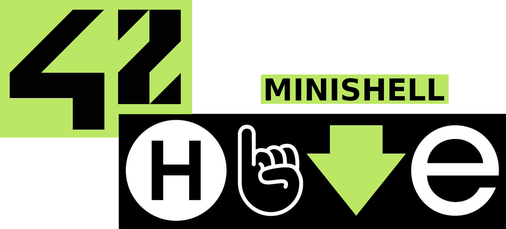

<h1 align="center">
  
</h1>

<p align="center">
	<b><i>Limited recreation of original Unix 🐧 shell</i></b><br>
</p>

<p align="center">
  
  
	
  
</p>

<p align="center">
    
  
</p>

<div align="center">

## Table of Contents
[📝 General](#-general)
[🛠️ Build](#️-build)
[⚡ Usage](#-usage)
[🚀 Details](#-details)
[♻️ Resources](#️-resources)

</div>

## 📝 General

Goal of the project is to create `shell` which supports basic `bash` functionalities.

These include file redirections, signal handling and pipes among others.

Also some of the basic `commands` such as `export` and `cd` and are supported as `buildins`.

## 🛠️ Build

GNU `make`, `gcc` and `readline` are required to build and compile the project.

⚠️ Shell was designed for `linux`. Extra steps might be required for MacOS and Windows. ⚠️

```bash
git clone --recurse-submodules https://github.com/Jarnomer/minishell.git
```

```bash
cd minishell && make all
```

## ⚡ Usage

```bash
make run
```

You can use following features as you would in bash.

| Feature                  | Description                                                                                     |
|--------------------------|-------------------------------------------------------------------------------------------------|
| Single Quotes         | Prevents shell from interpreting meta-characters in the quoted (`'`) sequence.                     |
| Double Quotes         | Prevents shell from interpreting meta-characters in the quoted (`"`) sequence, except for `$`.     |
| Pipes                 | Connects command outputs and inputs in the pipeline `\|`.             |
| Environment Variables | Expand to their values when `$` is followed by a sequence of characters.                     |
| Exit Status           | Expand `$?` to the exit status of the most recently executed foreground pipeline.                    |

I also supports these redirect operators and control sequences.

| Redirection | Description                      |
|-------------|----------------------------------|
| `<`         | Redirects input.                 |
| `>`         | Redirects output.                |
| `<<`        | Reads heredoc till delimiter.    |
| `>>`        | Redirects output in append mode. |

| Signal      | Description                          |
|-------------------|------------------------------- |
| `Ctrl-C`    | Displays a new prompt on a new line. |
| `Ctrl-D`    | Exits the shell.                     |
| `Ctrl-\`    | Does nothing.                        |

## 🚀 Details


## ♻️ Resources

[Bash Reference Manual](https://www.gnu.org/software/bash/manual/bash.html) official manual of GNU Bash features.

[minishell_tester](https://github.com/LucasKuhn/minishell_tester) excellent baseline tester, don't forget to check the forks.

## 4️⃣2️⃣ Footer

For my other 42 projects and general information, please refer the [Hive42](https://github.com/Jarnomer/Hive42) page.

I have also created error handling [unit testers](https://github.com/Jarnomer/42Testers) for `pipex`, `so_long` and `cub3D`.

### Cheers and good luck! 🥳